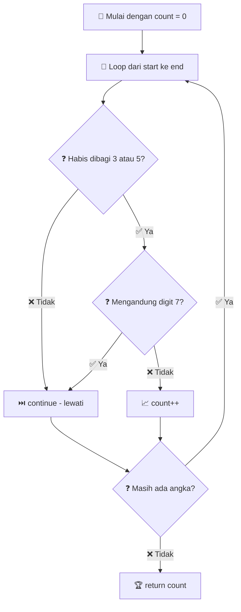

# 📖 Dokumentasi Function `countSpecialNumbers`

## 🎯 Gambaran Umum

Function ini menghitung jumlah **angka spesial** dalam rentang tertentu. Angka spesial adalah angka yang habis dibagi 3 atau 5, tetapi tidak mengandung digit 7.

---

## 💻 Kode Lengkap

```javascript
function countSpecialNumbers(start, end) {
    let count = 0;
    
    for (let i = start; i <= end; i++) {
        // Check if number is divisible by 3 or 5
        if (i % 3 !== 0 && i % 5 !== 0) {
            continue;
        }
        
        // Check if number contains digit 7
        if (i.toString().includes('7')) {
            continue;
        }
        
        // If we reach here, the number is special
        count++;
    }
    
    return count;
}
```

---

## 🔍 Analisis Kode Baris per Baris

### 📋 Bagian 1: Deklarasi Function dan Inisialisasi

```javascript
function countSpecialNumbers(start, end) {
    let count = 0;
```

| Baris | Penjelasan |
|-------|------------|
| `function countSpecialNumbers(start, end)` | Membuat function dengan nama `countSpecialNumbers` yang menerima 2 parameter |
| `let count = 0;` | Membuat variabel `count` untuk menghitung angka spesial, dimulai dari 0 |

### 🔄 Bagian 2: Loop Utama

```javascript
for (let i = start; i <= end; i++) {
```

| Komponen | Penjelasan |
|----------|------------|
| `let i = start` | Mulai dari angka `start` |
| `i <= end` | Lanjutkan selama `i` kurang dari atau sama dengan `end` |
| `i++` | Tambah `i` sebesar 1 setiap iterasi |

### ✅ Bagian 3: Pengecekan Pembagian

```javascript
if (i % 3 !== 0 && i % 5 !== 0) {
    continue;
}
```

| Elemen | Penjelasan |
|--------|------------|
| `i % 3 !== 0` | Cek apakah `i` TIDAK habis dibagi 3 |
| `&&` | Operator logika AND (dan) |
| `i % 5 !== 0` | Cek apakah `i` TIDAK habis dibagi 5 |
| `continue;` | Lewati angka ini dan lanjut ke angka berikutnya |

> 💡 **Logika**: Jika angka tidak habis dibagi 3 DAN tidak habis dibagi 5, maka lewati angka tersebut.

### 🚫 Bagian 4: Pengecekan Digit 7

```javascript
if (i.toString().includes('7')) {
    continue;
}
```

| Elemen | Penjelasan |
|--------|------------|
| `i.toString()` | Ubah angka `i` menjadi string (teks) |
| `.includes('7')` | Cek apakah string mengandung karakter '7' |
| `continue;` | Lewati angka ini jika mengandung digit 7 |

> 💡 **Contoh**: Angka 17 → `"17".includes('7')` → `true` → lewati angka ini

### 📊 Bagian 5: Penghitungan dan Return

```javascript
count++;
}

return count;
```

| Baris | Penjelasan |
|-------|------------|
| `count++;` | Tambah 1 ke `count` (angka ini spesial!) |
| `return count;` | Kembalikan total jumlah angka spesial |

---

## 🎯 Alur Kerja Function



---

## 📝 Contoh Eksekusi Step-by-Step

### Input: `countSpecialNumbers(10, 20)`

| Angka | Habis dibagi 3/5? | Mengandung 7? | Aksi | Count |
|-------|-------------------|---------------|------|-------|
| 10 | ✅ (÷5) | ❌ | count++ | 1 |
| 11 | ❌ | ❌ | continue | 1 |
| 12 | ✅ (÷3) | ❌ | count++ | 2 |
| 13 | ❌ | ❌ | continue | 2 |
| 14 | ❌ | ❌ | continue | 2 |
| 15 | ✅ (÷3,÷5) | ❌ | count++ | 3 |
| 16 | ❌ | ❌ | continue | 3 |
| 17 | ❌ | ✅ | continue | 3 |
| 18 | ✅ (÷3) | ❌ | count++ | 4 |
| 19 | ❌ | ❌ | continue | 4 |
| 20 | ✅ (÷5) | ❌ | count++ | 5 |

**Hasil Akhir**: `return 5`

---

## 🧠 Konsep Programming yang Digunakan

### 1. 🔄 **For Loop**
```javascript
for (let i = start; i <= end; i++)
```
- Mengulang proses untuk setiap angka dalam rentang

### 2. 🚦 **Conditional Statement**
```javascript
if (kondisi) { ... }
```
- Membuat keputusan berdasarkan kondisi tertentu

### 3. 📊 **Modulo Operator (`%`)**
```javascript
i % 3 !== 0
```
- Mengecek sisa pembagian untuk menentukan apakah habis dibagi

### 4. 🔄 **Continue Statement**
```javascript
continue;
```
- Melewati iterasi saat ini dan lanjut ke iterasi berikutnya

### 5. 🔤 **String Method**
```javascript
i.toString().includes('7')
```
- Mengubah angka ke string dan mencari karakter tertentu

---

## 💡 Tips Pemahaman untuk Pemula

### 🤔 Mengapa Menggunakan `continue`?
- **Tanpa `continue`**: Kita harus menulis `if-else` yang panjang
- **Dengan `continue`**: Kode lebih bersih dan mudah dibaca
- **Efisiensi**: Menghindari pengecekan yang tidak perlu

### 🎯 Logika "NOT" dalam Kondisi
```javascript
if (i % 3 !== 0 && i % 5 !== 0)
```
Ini berarti: "Jika angka TIDAK habis dibagi 3 DAN TIDAK habis dibagi 5"

### 📱 Mengapa `toString()`?
- Method `.includes()` hanya bekerja pada string
- Angka harus diubah ke string terlebih dahulu
- Contoh: `17` → `"17"` → bisa dicek apakah mengandung "7"

---

## 🔧 Cara Menggunakan Function

### Contoh Pemanggilan
```javascript
// Menghitung angka spesial dari 1 sampai 100
let result1 = countSpecialNumbers(1, 100);
console.log(result1); // Output: jumlah angka spesial

// Menghitung angka spesial dari 50 sampai 75
let result2 = countSpecialNumbers(50, 75);
console.log(result2); // Output: jumlah angka spesial

// Menghitung untuk satu angka saja
let result3 = countSpecialNumbers(15, 15);
console.log(result3); // Output: 1 (karena 15 spesial)
```

### Test Case
```javascript
console.log(countSpecialNumbers(10, 20)); // Expected: 5
console.log(countSpecialNumbers(1, 10));   // Expected: 4
console.log(countSpecialNumbers(7, 7));    // Expected: 0 (mengandung 7)
```

---

## ⚡ Analisis Kompleksitas

| Aspek | Nilai | Penjelasan |
|-------|-------|------------|
| **Time Complexity** | O(n × m) | n = jumlah angka, m = rata-rata digit per angka |
| **Space Complexity** | O(1) | Hanya menggunakan variabel konstan |
| **Efisiensi** | ⭐⭐⭐⭐ | Sangat efisien dengan `continue` |

---

## 🎓 Pembelajaran dari Kode Ini

✅ **Yang Dipelajari:**
- Cara menggunakan `for` loop dengan range
- Implementasi `continue` untuk kontrol alur
- Penggunaan modulo operator untuk cek pembagian
- Konversi tipe data (number ke string)
- Kombinasi multiple kondisi dengan operator logika

✅ **Best Practices yang Diterapkan:**
- Nama variabel yang jelas (`count`, `start`, `end`)
- Komentar yang informatif
- Struktur kode yang rapi dan mudah dibaca
- Penggunaan `continue` untuk meningkatkan efisiensi

---

*Semoga dokumentasi ini membantu pemahaman! 🚀*
