# 📖 Dokumentasi Function `countSpecialNumbers`

## 🎯 Gambaran Umum

Function ini menghitung jumlah **angka spesial** dalam rentang tertentu. Angka spesial adalah angka yang habis dibagi 3 atau 5, tetapi tidak mengandung digit 7.

---

## 💻 Kode Lengkap

```javascript
function countSpecialNumbers(start, end) {
  let count = 0;
  for (let num = start; num <= end; num++) {
    if (num % 3 !== 0 && num % 5 !== 0) {
      continue;
    }
    if (num.toString().includes('7')) {
      continue;
    }
    count++;
  }
  return count;
}
```

---

## 🔍 Analisis Kode Baris per Baris

### 📋 Bagian 1: Deklarasi Function dan Inisialisasi

```javascript
function countSpecialNumbers(start, end) {
  let count = 0;
```

| Baris | Penjelasan |
|-------|------------|
| `function countSpecialNumbers(start, end)` | Membuat function dengan nama `countSpecialNumbers` yang menerima 2 parameter |
| `let count = 0;` | Membuat variabel `count` untuk menghitung angka spesial, dimulai dari 0 |

### 🔄 Bagian 2: Loop Utama

```javascript
for (let num = start; num <= end; num++) {
```

| Komponen | Penjelasan |
|----------|------------|
| `let num = start` | Mulai dari angka `start` (menggunakan nama `num` yang lebih deskriptif) |
| `num <= end` | Lanjutkan selama `num` kurang dari atau sama dengan `end` |
| `num++` | Tambah `num` sebesar 1 setiap iterasi |

### ✅ Bagian 3: Pengecekan Pembagian

```javascript
if (num % 3 !== 0 && num % 5 !== 0) {
  continue;
}
```

| Elemen | Penjelasan |
|--------|------------|
| `num % 3 !== 0` | Cek apakah `num` TIDAK habis dibagi 3 |
| `&&` | Operator logika AND (dan) |
| `num % 5 !== 0` | Cek apakah `num` TIDAK habis dibagi 5 |
| `continue;` | Lewati angka ini dan lanjut ke angka berikutnya |

> 💡 **Logika**: Jika angka tidak habis dibagi 3 DAN tidak habis dibagi 5, maka lewati angka tersebut.

### 🚫 Bagian 4: Pengecekan Digit 7

```javascript
if (num.toString().includes('7')) {
  continue;
}
```

| Elemen | Penjelasan |
|--------|------------|
| `num.toString()` | Ubah angka `num` menjadi string (teks) |
| `.includes('7')` | Cek apakah string mengandung karakter '7' |
| `continue;` | Lewati angka ini jika mengandung digit 7 |

> 💡 **Contoh**: Angka 17 → `"17".includes('7')` → `true` → lewati angka ini

### 📊 Bagian 5: Penghitungan dan Return

```javascript
count++;
}
return count;
```

| Baris | Penjelasan |
|-------|------------|
| `count++;` | Tambah 1 ke `count` (angka ini spesial!) |
| `return count;` | Kembalikan total jumlah angka spesial |

---

## 🎯 Alur Kerja Function

```mermaid
graph TD
    A[🏁 Mulai dengan count = 0] --> B[🔄 Loop dari start ke end]
    B --> C{❓ Habis dibagi 3 atau 5?}
    C -->|❌ Tidak| D[⏭️ continue - lewati]
    C -->|✅ Ya| E{❓ Mengandung digit 7?}
    E -->|✅ Ya| D
    E -->|❌ Tidak| F[📈 count++]
    F --> G{❓ Masih ada angka?}
    D --> G
    G -->|✅ Ya| B
    G -->|❌ Tidak| H[🏆 return count]
```



---

## 📝 Contoh Eksekusi Step-by-Step

### Input: `countSpecialNumbers(10, 20)`

| num | Habis dibagi 3/5? | Mengandung 7? | Aksi | count |
|-----|-------------------|---------------|------|-------|
| 10 | ✅ (÷5) | ❌ | count++ | 1 |
| 11 | ❌ | ❌ | continue | 1 |
| 12 | ✅ (÷3) | ❌ | count++ | 2 |
| 13 | ❌ | ❌ | continue | 2 |
| 14 | ❌ | ❌ | continue | 2 |
| 15 | ✅ (÷3,÷5) | ❌ | count++ | 3 |
| 16 | ❌ | ❌ | continue | 3 |
| 17 | ❌ | ✅ | continue | 3 |
| 18 | ✅ (÷3) | ❌ | count++ | 4 |
| 19 | ❌ | ❌ | continue | 4 |
| 20 | ✅ (÷5) | ❌ | count++ | 5 |

**Hasil Akhir**: `return 5`

---

## 🧠 Konsep Programming yang Digunakan

### 1. 🔄 **For Loop**
```javascript
for (let num = start; num <= end; num++)
```
- Mengulang proses untuk setiap angka dalam rentang
- Menggunakan nama variabel `num` yang lebih deskriptif dari `i`

### 2. 🚦 **Conditional Statement**
```javascript
if (kondisi) { ... }
```
- Membuat keputusan berdasarkan kondisi tertentu
- Menggunakan 2 `if` terpisah untuk logika yang lebih jelas

### 3. 📊 **Modulo Operator (`%`)**
```javascript
num % 3 !== 0
```
- Mengecek sisa pembagian untuk menentukan apakah habis dibagi

### 4. 🔄 **Continue Statement**
```javascript
continue;
```
- Melewati iterasi saat ini dan lanjut ke iterasi berikutnya

### 5. 🔤 **String Method**
```javascript
num.toString().includes('7')
```
- Mengubah angka ke string dan mencari karakter tertentu

---

## 💡 Tips Pemahaman untuk Pemula

### 🤔 Mengapa Menggunakan `num` daripada `i`?
- **`num`**: Nama yang lebih deskriptif, langsung tahu bahwa ini adalah angka
- **`i`**: Nama umum untuk index, kurang deskriptif
- **Best Practice**: Gunakan nama variabel yang menjelaskan fungsinya

### 🎯 Mengapa 2 `if` Terpisah?
```javascript
// Lebih mudah dipahami:
if (num % 3 !== 0 && num % 5 !== 0) {
  continue;
}
if (num.toString().includes('7')) {
  continue;
}

// Daripada:
if ((num % 3 !== 0 && num % 5 !== 0) || num.toString().includes('7')) {
  continue;
}
```
- **Readability**: Setiap kondisi terpisah, lebih mudah dibaca
- **Debugging**: Lebih mudah untuk debug jika ada masalah
- **Maintenance**: Lebih mudah untuk memodifikasi kondisi

### 📱 Logika "Early Return" dengan `continue`
- **Konsep**: Keluar dari iterasi sesegera mungkin jika kondisi tidak terpenuhi
- **Benefit**: Menghindari nested `if-else` yang kompleks
- **Efisiensi**: Tidak perlu mengecek kondisi lain jika sudah gagal

---

## 🔧 Cara Menggunakan Function

### Contoh Pemanggilan
```javascript
// Menghitung angka spesial dari 1 sampai 100
let result1 = countSpecialNumbers(1, 100);
console.log(result1); // Output: jumlah angka spesial

// Menghitung angka spesial dari 50 sampai 75
let result2 = countSpecialNumbers(50, 75);
console.log(result2); // Output: jumlah angka spesial

// Menghitung untuk satu angka saja
let result3 = countSpecialNumbers(15, 15);
console.log(result3); // Output: 1 (karena 15 spesial)
```

### Test Case
```javascript
console.log(countSpecialNumbers(10, 20)); // Expected: 5
console.log(countSpecialNumbers(1, 10));   // Expected: 4
console.log(countSpecialNumbers(7, 7));    // Expected: 0 (mengandung 7)
console.log(countSpecialNumbers(77, 77));  // Expected: 0 (mengandung 7)
console.log(countSpecialNumbers(3, 3));    // Expected: 1 (habis dibagi 3)
```

---

## ⚡ Analisis Kompleksitas

| Aspek | Nilai | Penjelasan |
|-------|-------|------------|
| **Time Complexity** | O(n × m) | n = jumlah angka, m = rata-rata digit per angka |
| **Space Complexity** | O(1) | Hanya menggunakan variabel konstan |
| **Efisiensi** | ⭐⭐⭐⭐⭐ | Sangat efisien dengan early `continue` |

---

## 🆚 Perbandingan dengan Versi Sebelumnya

### Yang Berubah:
| Aspek | Versi Lama | Versi Baru | Keuntungan |
|-------|------------|------------|------------|
| **Nama Variabel Loop** | `i` | `num` | Lebih deskriptif |
| **Indentasi** | 4 spasi | 2 spasi | Lebih ringkas |
| **Struktur** | Sama | Sama | Konsisten |

### Yang Tetap:
- ✅ Logika algoritma identik
- ✅ Penggunaan `continue` statement
- ✅ Urutan pengecekan kondisi
- ✅ Return value yang sama

---

## 🎓 Pembelajaran dari Kode Ini

✅ **Yang Dipelajari:**
- Pentingnya penamaan variabel yang deskriptif
- Cara menggunakan `for` loop dengan range
- Implementasi `continue` untuk kontrol alur
- Penggunaan modulo operator untuk cek pembagian
- Konversi tipe data (number ke string)
- Kombinasi multiple kondisi dengan operator logika

✅ **Best Practices yang Diterapkan:**
- Nama variabel yang jelas dan deskriptif (`count`, `num`, `start`, `end`)
- Indentasi yang konsisten
- Struktur kode yang rapi dan mudah dibaca
- Penggunaan `continue` untuk meningkatkan efisiensi
- Pemisahan logika untuk readability yang lebih baik

---

## 🏆 Kelebihan Versi Ini

### 👍 **Strengths:**
- **Readability**: Kode mudah dibaca dan dipahami
- **Maintainability**: Mudah untuk dimodifikasi
- **Performance**: Efisien dengan early exit
- **Naming**: Variabel yang self-explanatory

### 🔧 **Possible Improvements:**
- Bisa menambahkan input validation
- Bisa menambahkan JSDoc comments
- Bisa menambahkan error handling

---

*Semoga dokumentasi ini membantu pemahaman kode yang lebih ringkas dan rapi! 🚀*
