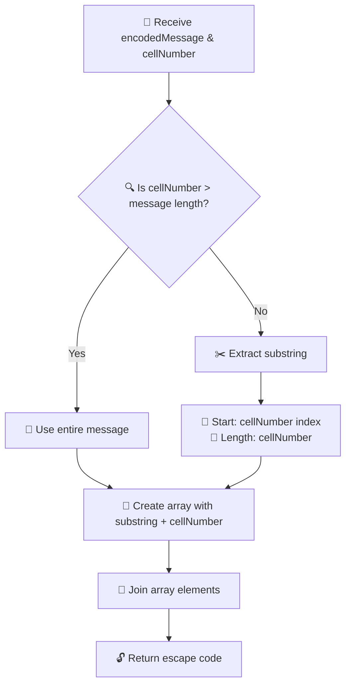

# 🔓 Prison Break: Decode Your Escape

> **Challenge Level:** 🌟 Easy  
> **Category:** String Manipulation & Array Operations  
> **Estimated Time:** 15-20 minutes

---

## 📖 The Story

```
🏢 You find yourself trapped in cell block 237...
🔍 A mysterious encoded message appears on your cell wall
💡 Your cell number holds the key to freedom
🚪 Can you decode the message and escape?
```

---

## 🎯 Mission Objective

Create a function named **`prisonBreak`** that combines:
- 📝 An encoded secret message
- 🔢 Your cell number
- ✨ A specific decoding algorithm

**Goal:** Generate the ultimate escape code!

---

## 🛠️ Technical Specifications

### Function Blueprint
```javascript
function prisonBreak(encodedMessage, cellNumber) {
    // 🔓 Your escape logic goes here
}
```

### Input Parameters
| 🏷️ Parameter | 📊 Type | 📝 Description |
|---------------|---------|----------------|
| `encodedMessage` | `string` | 🗂️ The secret message carved on your cell wall |
| `cellNumber` | `number` | 🔢 Your prison cell identification number |

### Output
| 🎯 Return Type | 📋 Description |
|----------------|----------------|
| `string` | 🔐 Your personalized escape code |

---

## 🔬 Decoding Algorithm

### Step-by-Step Process



### 🔢 Algorithm Breakdown

#### 1️⃣ **Substring Extraction**
```
📍 Start Index: cellNumber
📏 Length: cellNumber
```

#### 2️⃣ **Edge Case Handling**
```
🚨 IF cellNumber > encodedMessage.length
   THEN use entire message
```

#### 3️⃣ **Array Construction**
```
📦 Array = [extracted_substring, cellNumber_as_string]
```

#### 4️⃣ **Final Assembly**
```
🔗 Escape Code = Array.join('')
```

---

## 💡 Visual Examples

### Example 1: Normal Case
```
📨 Input:
   encodedMessage: "FREEDOM"
   cellNumber: 3

🔍 Process:
   ├─ Start at index 3: "D"
   ├─ Extract 3 characters: "DOM"
   ├─ Create array: ["DOM", "3"]
   └─ Join: "DOM3"

🔓 Output: "DOM3"
```

### Example 2: Edge Case
```
📨 Input:
   encodedMessage: "ESCAPE"
   cellNumber: 10

🔍 Process:
   ├─ cellNumber (10) > message length (6)
   ├─ Use entire message: "ESCAPE"
   ├─ Create array: ["ESCAPE", "10"]
   └─ Join: "ESCAPE10"

🔓 Output: "ESCAPE10"
```

### Example 3: Small Cell Number
```
📨 Input:
   encodedMessage: "BREAKOUT"
   cellNumber: 2

🔍 Process:
   ├─ Start at index 2: "E"
   ├─ Extract 2 characters: "EA"
   ├─ Create array: ["EA", "2"]
   └─ Join: "EA2"

🔓 Output: "EA2"
```

---

## 🎮 Test Your Solution

```javascript
// 🧪 Test Cases
console.log(prisonBreak("FREEDOM", 3));    // Expected: "DOM3"
console.log(prisonBreak("ESCAPE", 10));    // Expected: "ESCAPE10"
console.log(prisonBreak("BREAKOUT", 2));   // Expected: "EA2"
console.log(prisonBreak("LIBERTY", 4));    // Expected: "RTY4"
```

---

## 🏆 Success Criteria

Your function should handle:
- ✅ **Normal cases** where cellNumber ≤ message length
- ✅ **Edge cases** where cellNumber > message length
- ✅ **Boundary conditions** (empty strings, zero values)
- ✅ **Type conversion** (number to string)

---

## 🔍 Key Concepts Tested

| 🎯 Concept | 📚 Skills |
|------------|-----------|
| **String Manipulation** | `substring()`, indexing |
| **Array Operations** | Array creation, `join()` |
| **Conditional Logic** | Edge case handling |
| **Type Conversion** | Number to string |

---

## 💪 Challenge Yourself

Once you've solved the basic version, try these variations:
- 🌟 **Easy+**: Add input validation
- 🌟🌟 **Medium**: Reverse the substring before joining
- 🌟🌟🌟 **Hard**: Implement multiple decoding methods

---

*🗝️ Remember: Every great escape starts with cracking the code!*
