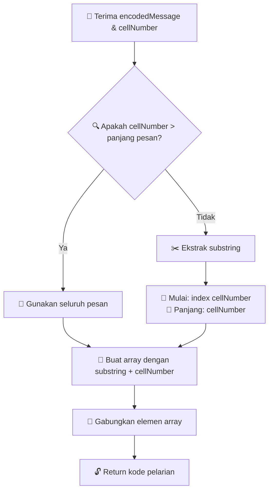

# 🔓 Prison Break: Dekode Jalan Keluarmu

> **Level Tantangan:** 🌟 Mudah  
> **Kategori:** Manipulasi String & Operasi Array  
> **Estimasi Waktu:** 15-20 menit

---

## 📖 Cerita Latar Belakang

```
🏢 Kamu terjebak di blok sel nomor 237...
🔍 Pesan rahasia misterius muncul di dinding selmu
💡 Nomor selmu memegang kunci menuju kebebasan
🚪 Bisakah kamu memecahkan kode pesan dan melarikan diri?
```

---

## 🎯 Misi Utama

Buat sebuah fungsi bernama **`prisonBreak`** yang menggabungkan:
- 📝 Pesan rahasia yang terenkripsi
- 🔢 Nomor sel penjara
- ✨ Algoritma dekripsi khusus

**Tujuan:** Menghasilkan kode pelarian yang sempurna!

---

## 🛠️ Spesifikasi Teknis

### Blueprint Fungsi
```javascript
function prisonBreak(encodedMessage, cellNumber) {
    // 🔓 Logika pelarian kamu ada di sini
}
```

### Parameter Input
| 🏷️ Parameter | 📊 Type | 📝 Deskripsi |
|---------------|---------|----------------|
| `encodedMessage` | `string` | 🗂️ Pesan rahasia yang terukir di dinding sel |
| `cellNumber` | `number` | 🔢 Nomor identifikasi sel penjaramu |

### Output
| 🎯 Return Type | 📋 Deskripsi |
|----------------|----------------|
| `string` | 🔐 Kode pelarian personal kamu |

---

## 🔬 Algoritma Dekripsi

### Proses Langkah demi Langkah



### 🔢 Rincian Algoritma

#### 1️⃣ **Ekstraksi Substring**
```
📍 Index Mulai: cellNumber
📏 Panjang: cellNumber
```

#### 2️⃣ **Penanganan Edge Case**
```
🚨 JIKA cellNumber > panjang encodedMessage
   MAKA gunakan seluruh pesan
```

#### 3️⃣ **Konstruksi Array**
```
📦 Array = [substring_yang_diekstrak, cellNumber_sebagai_string]
```

#### 4️⃣ **Perakitan Final**
```
🔗 Kode Pelarian = Array.join('')
```

---

## 💡 Contoh Visual

### Contoh 1: Kasus Normal
```
📨 Input:
   encodedMessage: "FREEDOM"
   cellNumber: 3

🔍 Proses:
   ├─ Mulai di index 3: "D"
   ├─ Ekstrak 3 karakter: "DOM"
   ├─ Buat array: ["DOM", "3"]
   └─ Gabungkan: "DOM3"

🔓 Output: "DOM3"
```

### Contoh 2: Edge Case
```
📨 Input:
   encodedMessage: "ESCAPE"
   cellNumber: 10

🔍 Proses:
   ├─ cellNumber (10) > panjang pesan (6)
   ├─ Gunakan seluruh pesan: "ESCAPE"
   ├─ Buat array: ["ESCAPE", "10"]
   └─ Gabungkan: "ESCAPE10"

🔓 Output: "ESCAPE10"
```

### Contoh 3: Nomor Sel Kecil
```
📨 Input:
   encodedMessage: "BREAKOUT"
   cellNumber: 2

🔍 Proses:
   ├─ Mulai di index 2: "E"
   ├─ Ekstrak 2 karakter: "EA"
   ├─ Buat array: ["EA", "2"]
   └─ Gabungkan: "EA2"

🔓 Output: "EA2"
```

---

## 🎮 Uji Solusi Kamu

```javascript
// 🧪 Test Cases
console.log(prisonBreak("FREEDOM", 3));    // Expected: "DOM3"
console.log(prisonBreak("ESCAPE", 10));    // Expected: "ESCAPE10"
console.log(prisonBreak("BREAKOUT", 2));   // Expected: "EA2"
console.log(prisonBreak("LIBERTY", 4));    // Expected: "RTY4"
```

---

## 🏆 Kriteria Keberhasilan

Fungsi kamu harus dapat menangani:
- ✅ **Kasus normal** dimana cellNumber ≤ panjang pesan
- ✅ **Edge cases** dimana cellNumber > panjang pesan
- ✅ **Kondisi batas** (string kosong, nilai nol)
- ✅ **Konversi tipe** (number ke string)

---

## 🔍 Konsep Kunci yang Diuji

| 🎯 Konsep | 📚 Keterampilan |
|------------|-----------|
| **Manipulasi String** | `substring()`, indexing |
| **Operasi Array** | Pembuatan array, `join()` |
| **Logika Kondisional** | Penanganan edge case |
| **Konversi Tipe** | Number ke string |

---

## 💪 Tantang Diri Kamu

Setelah menyelesaikan versi dasar, coba variasi ini:
- 🌟 **Mudah+**: Tambahkan validasi input
- 🌟🌟 **Menengah**: Balik substring sebelum digabungkan
- 🌟🌟🌟 **Sulit**: Implementasikan multiple metode dekoding

---

*🗝️ Ingat: Setiap pelarian hebat dimulai dengan memecahkan kode!*
