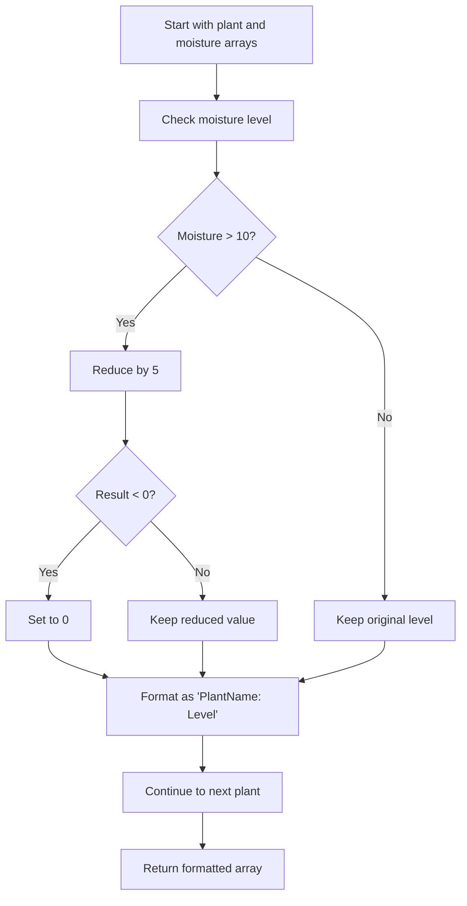

# 🌱 Drying Overwatered Plants

## Challenge Overview

> **Difficulty Level:** `Easy` 🟢

Create a function that helps a gardener manage overwatered plants in their backyard by intelligently reducing moisture levels and preventing plant damage.

---

## 📋 Function Requirements

### Function Signature
```javascript
function dryPlants(plants, moistureLevels)
```

### 🎯 Objective
Simulate the process of drying out overwatered plants by identifying those with excessive moisture and safely reducing their water levels.

---

## 🔄 Implementation Steps

The function should follow these sequential steps:

1. **🔍 Iterate & Analyze**
   - Loop through the array of plants and their corresponding moisture levels

2. **💧 Identify Overwatered Plants**
   - Check for plants with moisture levels **above 10**

3. **⬇️ Reduce Moisture**
   - Decrease moisture level by **5** for overwatered plants

4. **🛡️ Safety Check**
   - Prevent negative moisture levels by setting any negative values to **0**

5. **📝 Format Results**
   - Create formatted strings for each plant showing their new moisture status

---

## 📥 Parameters

| Parameter | Type | Description |
|-----------|------|-------------|
| `plants` | `Array<string>` | Array of plant names |
| `moistureLevels` | `Array<number>` | Array of moisture levels corresponding to each plant |

### 📐 Parameter Relationship
- Both arrays have the same length
- Each moisture level at index `i` corresponds to the plant at index `i`

---

## 📤 Return Value

**Type:** `Array<string>`

**Format:** Each string follows the pattern:
```
"PlantName: NewMoistureLevel"
```

### Example Output Format
```javascript
[
  "Rose: 8",
  "Tulip: 0", 
  "Daisy: 12"
]
```

---

## 🧪 Logic Flow



---

## 💡 Key Considerations

- **🔒 Safety First:** Always prevent negative moisture levels
- **🎯 Selective Treatment:** Only treat plants with moisture > 10
- **📊 Consistent Format:** Maintain uniform output formatting
- **🔄 Preserve Order:** Keep the same order as input arrays

---

## 🏷️ Tags
`#JavaScript` `#Arrays` `#Conditionals` `#String-Formatting` `#Beginner-Friendly`
