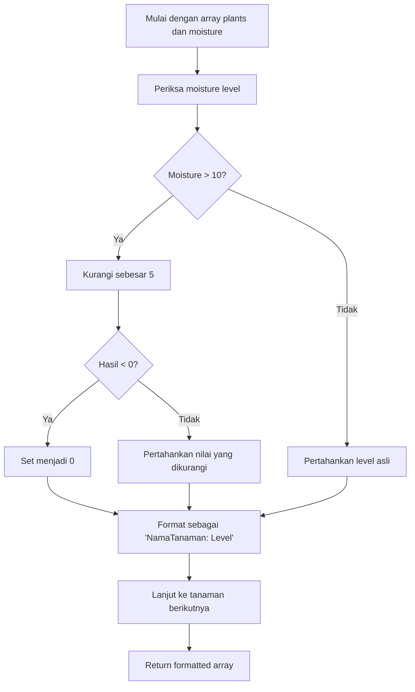

# 🌱 Mengeringkan Tanaman yang Kelebihan Air

## Overview Challenge

> **Tingkat Kesulitan:** `Easy` 🟢

Buatlah sebuah function yang membantu seorang tukang kebun mengelola tanaman yang kelebihan air di halaman belakang mereka dengan cara mengurangi moisture level secara cerdas dan mencegah kerusakan tanaman.

---

## 📋 Requirements Function

### Function Signature
```javascript
function dryPlants(plants, moistureLevels)
```

### 🎯 Tujuan
Mensimulasikan proses pengeringan tanaman yang kelebihan air dengan mengidentifikasi tanaman yang memiliki kelembaban berlebihan dan mengurangi water level mereka dengan aman.

---

## 🔄 Langkah-langkah Implementasi

Function harus mengikuti langkah-langkah berurutan berikut:

1. **🔍 Iterate & Analyze**
   - Loop melalui array tanaman dan moisture level yang sesuai

2. **💧 Identifikasi Tanaman Kelebihan Air**
   - Periksa tanaman dengan moisture level **di atas 10**

3. **⬇️ Kurangi Moisture**
   - Kurangi moisture level sebesar **5** untuk tanaman yang kelebihan air

4. **🛡️ Safety Check**
   - Cegah moisture level negatif dengan mengatur nilai negatif menjadi **0**

5. **📝 Format Results**
   - Buat formatted string untuk setiap tanaman yang menunjukkan status moisture baru mereka

---

## 📥 Parameters

| Parameter | Type | Deskripsi |
|-----------|------|-----------|
| `plants` | `Array<string>` | Array nama-nama tanaman |
| `moistureLevels` | `Array<number>` | Array moisture level yang sesuai dengan setiap tanaman |

### 📐 Hubungan Parameter
- Kedua array memiliki panjang yang sama
- Setiap moisture level pada index `i` sesuai dengan tanaman pada index `i`

---

## 📤 Return Value

**Type:** `Array<string>`

**Format:** Setiap string mengikuti pola:
```
"NamaTanaman: MoistureLevelBaru"
```

### Contoh Output Format
```javascript
[
  "Rose: 8",
  "Tulip: 0", 
  "Daisy: 12"
]
```

---

## 🧪 Logic Flow



---

## 💡 Pertimbangan Utama

- **🔒 Keamanan Utama:** Selalu cegah moisture level negatif
- **🎯 Treatment Selektif:** Hanya tangani tanaman dengan moisture > 10
- **📊 Format Konsisten:** Jaga keseragaman output formatting
- **🔄 Preserve Order:** Pertahankan urutan yang sama dengan input array

---

## 🏷️ Tags
`#JavaScript` `#Arrays` `#Conditionals` `#String-Formatting` `#Beginner-Friendly`
